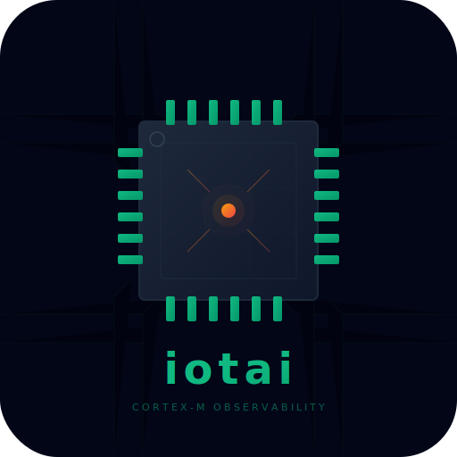

<p align="center">
  
</p>

<h1 align="center">ferrite-sdk</h1>

<p align="center">
  <strong>Firmware observability for ARM Cortex-M — crashes, metrics, and logs with zero alloc.</strong>
</p>

<p align="center">
  <a href="https://github.com/mighty840/ferrite-sdk/actions"></a>
  <a href="https://crates.io/crates/ferrite-sdk"></a>
  <a href="https://docs.rs/ferrite-sdk"></a>
  <a href="#license"></a>
  <a href="https://mighty840.github.io/ferrite-sdk/"></a>
</p>

---

## What It Does

ferrite-sdk captures everything you need to debug embedded devices in the field:

- **HardFault capture** — all Cortex-M registers, CFSR/HFSR, 64-byte stack snapshot
- **Reboot reason tracking** — power-on, watchdog, fault, brownout, software reset
- **Metrics** — counters, gauges, histograms in a fixed-capacity ring buffer
- **Trace logs** — defmt output captured and uploaded as binary fragments
- **Transport agnostic** — UART, BLE, LoRa, USB CDC, HTTP — implement one trait
- **Chunk encryption** — AES-128-CCM for untrusted transports
- **RLE compression** — bandwidth-efficient chunk encoding for constrained links
- **OTA negotiation** — firmware update coordination via chunk protocol

Data survives reboots via retained RAM. The companion server stores, decodes, and symbolicates everything.

The platform includes a full-stack observability pipeline: an edge **gateway** for BLE/USB/LoRa bridging, an **ingestion server** with alerting, Prometheus metrics, and role-based access control, and a **web dashboard** for real-time fleet monitoring.


## Memory Footprint

Default configuration: **~1.7 KB RAM, ~6 KB flash**. No alloc, no std, no panics.

## Quickstart (Embassy + nRF52840)

**1. Add dependencies:**

```toml
[dependencies]
ferrite-sdk = { version = "0.1", features = ["cortex-m", "defmt", "embassy"] }
ferrite-embassy = "0.1"
```

**2. Add linker fragment** (see [`linker/nrf52840-retained.x`](linker/nrf52840-retained.x))

**3. Initialize the SDK:**

```rust
ferrite_sdk::init(SdkConfig {
    device_id: "sensor-42",
    firmware_version: env!("CARGO_PKG_VERSION"),
    build_id: 0,
    ticks_fn: || embassy_time::Instant::now().as_ticks(),
    ram_regions: &[RamRegion { start: 0x20000000, end: 0x20040000 }],
});
```

**4. Record telemetry:**

```rust
ferrite_sdk::metric_gauge!("temperature", 23.5);
ferrite_sdk::metric_increment!("packets_sent");
defmt::info!("system started");
```

**5. Upload periodically:**

```rust
#[embassy_executor::task]
async fn upload(transport: MyUart) -> ! {
    ferrite_embassy::upload_task::upload_loop(transport, Duration::from_secs(60)).await
}
```

## Supported Targets

| Target | Architecture | Example |
|--------|-------------|---------|
| nRF52840 | Cortex-M4F | `examples/embassy-nrf52840` |
| STM32F4 | Cortex-M4F | Linker script included |
| RP2040 | Cortex-M0+ | Linker script included |

All `thumbv7m-none-eabi`, `thumbv7em-none-eabi`, and `thumbv7em-none-eabihf` targets are supported.

## Repository Structure

| Crate | Description |
|-------|-------------|
| [`ferrite-sdk`](ferrite-sdk/) | Core `no_std` SDK — crashes, metrics, trace, chunks, encryption, compression |
| [`ferrite-embassy`](ferrite-embassy/) | Embassy async upload task |
| [`ferrite-rtic`](ferrite-rtic/) | RTIC resource wrapper + blocking upload |
| [`ferrite-ffi`](ferrite-ffi/) | C FFI static library for Zephyr/FreeRTOS |
| [`ferrite-server`](ferrite-server/) | Ingestion server — auth, alerting, Prometheus, groups, OTA, rate limiting |
| [`ferrite-dashboard`](ferrite-dashboard/) | Dioxus WASM dashboard — fleet view, metrics charts, fault diagnostics |
| [`ferrite-gateway`](ferrite-gateway/) | Edge gateway — BLE/USB/LoRa chunk forwarding with offline buffering |
| [`ferrite-ble-nrf`](ferrite-ble-nrf/) | nRF52840 BLE transport (SoftDevice, excluded from workspace) |

## Build

```bash
# Host tests (no embedded toolchain needed)
cargo build -p ferrite-sdk --no-default-features
cargo test -p ferrite-sdk --no-default-features
cargo test -p ferrite-server

# Cross-compile for Cortex-M
rustup target add thumbv7em-none-eabihf
cargo build -p ferrite-sdk --features cortex-m,defmt,embassy --target thumbv7em-none-eabihf

# Run the server (uses .env for config, see .env.example)
cargo run -p ferrite-server

# Run the dashboard (proxies API to localhost:4000)
cd ferrite-dashboard && dx serve

# Build the edge gateway
cargo build -p ferrite-gateway

# Docs site
cd docs && npm install && npm run dev
```

## Documentation

Full documentation is available at the [VitePress docs site](https://mighty840.github.io/ferrite-sdk/), covering:

- [Architecture & design](docs/guide/architecture.md)
- [Transport layer](docs/guide/transports.md) (UART, BLE, USB CDC, HTTP, LoRa)
- [Security & encryption](docs/guide/security.md) (AES-128-CCM, RBAC, API keys)
- [Binary chunk wire format](docs/reference/chunk-format.md)
- [Server configuration](docs/server/configuration.md) (auth, alerting, retention, Prometheus)
- [Dashboard guide](docs/dashboard/) (fleet view, metrics, faults, exports)
- [Gateway setup](docs/gateway/) (BLE/USB/LoRa edge bridging)
- [C FFI API reference](docs/reference/c-api.md)
- [Integration guides](docs/integrations/) (Embassy, RTIC, bare-metal, Zephyr, FreeRTOS)
- [Target platform setup](docs/targets/) (nRF52840, RP2040, STM32F4)

## License

Licensed under the [MIT License](LICENSE).
